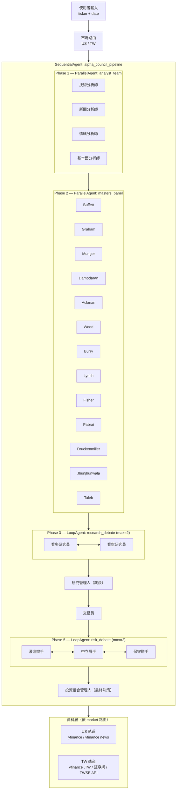

# AlphaCouncil

AlphaCouncil 是一個以 **Google ADK**（Agent Development Kit）驅動的多代理人投資分析框架，深受以下兩個優秀開源專案的啟發與影響：

- [**ai-hedge-fund**](https://github.com/virattt/ai-hedge-fund) by [@virattt](https://github.com/virattt) — 投資大師人格代理人的設計理念
- [**TradingAgents**](https://github.com/TauricResearch/TradingAgents) by Tauric Research — 多代理人辯論式決策架構（[論文](https://arxiv.org/abs/2412.20138)）

本專案在上述基礎上，以 Google ADK 的固定編排能力重新實作，並擴展支援台股市場與更多投資大師視角。

---

## 設計原則

- **固定編排**：以 `SequentialAgent`→`ParallelAgent`→`LoopAgent` 組合構成確定性流程，不依賴 LLM 動態路由
- **雙市場支援**：依 ticker 自動偵測 US / TW 市場，切換資料源、新聞來源與大師分析語境
- **13 位投資大師雙版本**：相同哲學框架，但 US 版以英文輸出並聚焦美市指標，TW 版以繁體中文輸出並納入台股特有脈絡
- **ADK 原生開發體驗**：透過 `adk web` debug UI、`adk run` CLI、`adk api_server` REST API 三種介面使用

> **免責聲明**：本專案僅供教育與研究用途，不構成任何投資建議。

---

## 開發方式

本專案現在以 `uv` 管理 Python 依賴，並透過 `make` 提供常用指令：

```bash
make sync
make run
make web
make api-server
```

- `make sync`：使用 `uv sync` 安裝並同步依賴
- `make run`：使用 `adk run alpha_council` 啟動 CLI
- `make web`：使用 `adk web` 啟動 ADK Web UI
- `make api-server`：使用 `adk api_server` 啟動 API 服務

如果你偏好直接使用 `uv`，也可以執行：

```bash
uv run adk run alpha_council
uv run adk web
uv run adk api_server
```

---

## 系統架構



---

## 13 位投資大師

| 代碼                    | 名稱                  | 投資哲學                              |
| ----------------------- | --------------------- | ------------------------------------- |
| `warren_buffett`        | Warren Buffett        | 以合理價格買優質公司，長期持有        |
| `ben_graham`            | Ben Graham            | 安全邊際，尋找低於內在價值的標的      |
| `charlie_munger`        | Charlie Munger        | 心智模型，只買最優質的企業            |
| `aswath_damodaran`      | Aswath Damodaran      | 嚴謹的故事敘述與數字驅動估值          |
| `bill_ackman`           | Bill Ackman           | 激進主義，推動企業變革                |
| `cathie_wood`           | Cathie Wood           | 顛覆性創新，長期成長                  |
| `michael_burry`         | Michael Burry         | 逆向投資，尋找深度被低估標的          |
| `peter_lynch`           | Peter Lynch           | 投資你了解的，尋找十倍股              |
| `phil_fisher`           | Phil Fisher           | 深度調研（Scuttlebutt），質化成長分析 |
| `mohnish_pabrai`        | Mohnish Pabrai        | Dhandho——低風險高報酬的翻倍機會       |
| `stanley_druckenmiller` | Stanley Druckenmiller | 宏觀驅動，不對稱風險機會              |
| `rakesh_jhunjhunwala`   | Rakesh Jhunjhunwala   | 成長與價值並重，長期持有高信念部位    |
| `nassim_taleb`          | Nassim Taleb          | 尾部風險防護，槓鈴策略                |

---

## 致謝

本專案的設計靈感主要來自以下研究與開源工作，在此表達誠摯的感謝：

- **ai-hedge-fund** — [@virattt](https://github.com/virattt)：投資大師代理人的人格建模框架
- **TradingAgents** — [Tauric Research](https://github.com/TauricResearch/TradingAgents)：多代理人辯論決策架構
