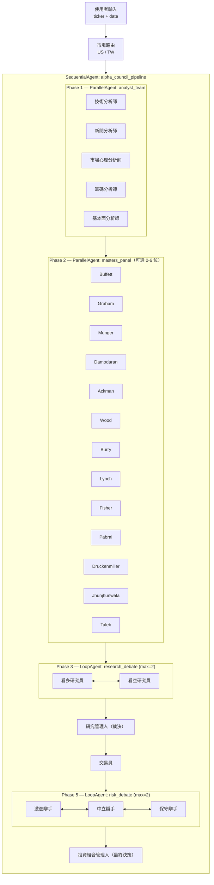

# AlphaCouncil

AlphaCouncil 是一個以 **Google ADK**（Agent Development Kit）驅動的多代理人投資分析框架，深受以下兩個優秀開源專案的啟發與影響：

- [**ai-hedge-fund**](https://github.com/virattt/ai-hedge-fund) by [@virattt](https://github.com/virattt) — 投資大師人格代理人的設計理念
- [**TradingAgents**](https://github.com/TauricResearch/TradingAgents) by Tauric Research — 多代理人辯論式決策架構（[論文](https://arxiv.org/abs/2412.20138)）

本專案在上述基礎上，以 Google ADK 的固定編排能力重新實作，並擴展支援台股市場與更多投資大師視角。

---

## 設計原則

- **固定編排**：以 `SequentialAgent`→`ParallelAgent`→`LoopAgent` 組合構成確定性流程，不依賴 LLM 動態路由
- **雙市場支援**：依 ticker 自動偵測 US / TW 市場，切換資料源、新聞來源與大師分析語境
- **13 位投資大師雙版本**：相同哲學框架，但 US 版以英文輸出並聚焦美市指標，TW 版以繁體中文輸出並納入台股特有脈絡
- **ADK 原生開發體驗**：透過 `adk web` debug UI、`adk run` CLI、`adk api_server` REST API 三種介面使用

> **免責聲明**：本專案僅供教育與研究用途，不構成任何投資建議。

---

## 開發方式

本專案現在以 `uv` 管理 Python 依賴，並透過 `make` 提供常用指令：

```bash
make sync
make run
make run-cli
make web
make api-server
```

- `make sync`：使用 `uv sync` 安裝並同步依賴
- `make run`：使用 `adk run alpha_council` 啟動 CLI
- `make run-cli`：使用新入口 `alpha-council run` 執行一次完整 pipeline
- `make web`：使用 `adk web` 啟動 ADK Web UI
- `make api-server`：使用 `adk api_server` 啟動 API 服務

本專案採 local-first；雲端部署方案不屬於主線範圍，請依需求自行延伸。

如果你偏好直接使用 `uv`，也可以執行：

```bash
uv run adk run alpha_council
uv run alpha-council run --ticker 2330 --market tw --masters 1,3,5 --report-format json
uv run adk web
uv run adk api_server
```

`alpha-council run` 支援以下參數：

- `--ticker`（必要）
- `--market`：`us|tw`（未提供會自動推斷）
- `--masters`：可傳編號或名稱（例如 `1,3,5` 或 `warren_buffett,ben_graham`）
- `--report-format`：`json|md`（優先序：CLI > `REPORT_FORMAT` > `json`）
- `--timeout-seconds`：單次執行逾時秒數（預設讀取 `ORCHESTRATOR_TIMEOUT_SECONDS`，預設值 1800）
- `--debug`：顯示事件流與最終回應原文（除錯模式）

模型供應商由 env 控制：

- `ALPHACOUNCIL_MODEL_PROVIDER=gemini|ollama`
- `ALPHACOUNCIL_MODEL=...`
- `ALPHACOUNCIL_ENV_FILE=/path/to/.env` 可指定額外 env 檔

Gemini 範例：

```env
ALPHACOUNCIL_MODEL_PROVIDER=gemini
ALPHACOUNCIL_MODEL=gemini-3.1-flash-lite
GOOGLE_API_KEY=...
```

Ollama 範例：

```env
ALPHACOUNCIL_MODEL_PROVIDER=ollama
ALPHACOUNCIL_MODEL=gemma3:latest
OLLAMA_API_BASE=http://localhost:11434
OLLAMA_API_KEY=
OLLAMA_CF_ACCESS_CLIENT_ID=
OLLAMA_CF_ACCESS_CLIENT_SECRET=
OLLAMA_CF_AUTHORIZATION=
```

使用 Ollama 時請優先選擇支援 tool calling 的模型；本專案透過 ADK 的 LiteLLM 整合走 `ollama_chat/...` 路徑。
若 Ollama 是經由 Cloudflare 或其他 gateway 對外暴露，可額外設定 `OLLAMA_API_KEY`（或 `OLLAMA_AUTH_TOKEN`）作為 Bearer token。
若是 Cloudflare Access service token，請改設 `OLLAMA_CF_ACCESS_CLIENT_ID` 與 `OLLAMA_CF_ACCESS_CLIENT_SECRET`，系統會自動附帶 `CF-Access-Client-Id` / `CF-Access-Client-Secret` headers。
若 gateway 還要求 `CF_Authorization` cookie，可再設 `OLLAMA_CF_AUTHORIZATION`；系統會自動附帶 `Cookie: CF_Authorization=...`。

持久化輸出由環境變數控制：

- `ALPHACOUNCIL_PERSIST_ENABLED=true` 才會落檔
- `GCS_BUCKET_ROOT=gs://...` 時寫入 GCS，否則寫入 `LOCAL_REPORT_ROOT`（預設 `./reports`）
- `LOCAL_REPORT_ROOT` 與 `ALPHACOUNCIL_ENV_FILE` 都支援 `~` 與 `$VAR` 路徑展開

---

## 系統架構


```mermaid
flowchart TD
    INPUT["使用者輸入<br/>ticker + date"]
    ROUTER["市場路由<br/>US / TW"]

    INPUT --> ROUTER

    ROUTER --> PIPELINE

    subgraph PIPELINE["SequentialAgent: alpha_council_pipeline"]
        direction TB

        subgraph P1["Phase 1 — ParallelAgent: analyst_team"]
            direction LR
            T["技術分析師"] & N["新聞分析師"] & P["市場心理分析師"] & C["籌碼分析師"] & F["基本面分析師"]
        end

        subgraph P2["Phase 2 — ParallelAgent: masters_panel（可選 0-6 位）"]
            direction LR
            M1["Buffett"] & M2["Graham"] & M3["Munger"] & M4["Damodaran"]
            M5["Ackman"] & M6["Wood"] & M7["Burry"] & M8["Lynch"]
            M9["Fisher"] & M10["Pabrai"] & M11["Druckenmiller"] & M12["Jhunjhunwala"] & M13["Taleb"]
        end

        subgraph P3["Phase 3 — LoopAgent: research_debate (max=2)"]
            direction LR
            BULL["看多研究員"] <--> BEAR["看空研究員"]
        end

        RM["研究管理人（裁決）"]
        TRADER["交易員"]

        subgraph P5["Phase 5 — LoopAgent: risk_debate (max=2)"]
            direction LR
            AGG["激進辯手"] <--> NEU["中立辯手"] <--> CON["保守辯手"]
        end

        PM["投資組合管理人（最終決策）"]

        P1 --> P2 --> P3 --> RM --> TRADER --> P5 --> PM
    end

```

---

## 13 位投資大師

| 代碼                    | 名稱                  | 投資哲學                              |
| ----------------------- | --------------------- | ------------------------------------- |
| `warren_buffett`        | Warren Buffett        | 以合理價格買優質公司，長期持有        |
| `ben_graham`            | Ben Graham            | 安全邊際，尋找低於內在價值的標的      |
| `charlie_munger`        | Charlie Munger        | 心智模型，只買最優質的企業            |
| `aswath_damodaran`      | Aswath Damodaran      | 嚴謹的故事敘述與數字驅動估值          |
| `bill_ackman`           | Bill Ackman           | 激進主義，推動企業變革                |
| `cathie_wood`           | Cathie Wood           | 顛覆性創新，長期成長                  |
| `michael_burry`         | Michael Burry         | 逆向投資，尋找深度被低估標的          |
| `peter_lynch`           | Peter Lynch           | 投資你了解的，尋找十倍股              |
| `phil_fisher`           | Phil Fisher           | 深度調研（Scuttlebutt），質化成長分析 |
| `mohnish_pabrai`        | Mohnish Pabrai        | Dhandho——低風險高報酬的翻倍機會       |
| `stanley_druckenmiller` | Stanley Druckenmiller | 宏觀驅動，不對稱風險機會              |
| `rakesh_jhunjhunwala`   | Rakesh Jhunjhunwala   | 成長與價值並重，長期持有高信念部位    |
| `nassim_taleb`          | Nassim Taleb          | 尾部風險防護，槓鈴策略                |

---

## 致謝

本專案的設計靈感主要來自以下研究與開源工作，在此表達誠摯的感謝：

- **ai-hedge-fund** — [@virattt](https://github.com/virattt)：投資大師代理人的人格建模框架
- **TradingAgents** — [Tauric Research](https://github.com/TauricResearch/TradingAgents)：多代理人辯論決策架構
