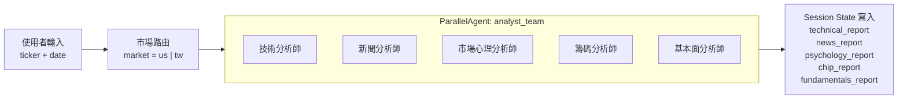

# 分析師層 (Analysts)

> **參考來源**：本規劃基於 [TradingAgents](https://github.com/TauricResearch/TradingAgents) 的 `agents/analysts/` 架構，並改用 Google ADK 實作。  
> **設計理念**：保持 LangGraph 的分析師分工邏輯，但採用 ADK 的 `ParallelAgent` 機制。

---

## 定位

分析師層是 AlphaCouncil 的**基礎資料蒐集與初步分析階段** (Phase 1)，由五位專業分析師以 `ParallelAgent` 模式並行運作，提供客觀、結構化的市場數據分析報告。

---

## 設計原則

- **市場中立**：不帶投資偏見，純粹呈現數據與事實
- **並行運作**：五位分析師同時執行，提升效率
- **雙市場覆蓋**：每位分析師需處理 US / TW 雙市場資料源差異
- **結構化輸出**：產出標準格式報告，供後續 Phase 使用
- **職責拆分清楚**：技術、心理、籌碼、新聞、基本面分開處理，避免語意重疊

---

## 五位分析師

### 1. 技術分析師 (Technical Analyst)

**職責**：分析價格走勢與技術指標

**使用工具**：

- `get_stock_data(ticker, start, end)` → OHLCV 資料
- `get_indicators(ticker, start, end)` → 技術指標

**資料策略**：

- US / TW 技術分析主流程皆以 `yfinance` 為主
- TWSE / TPEX 官方 API 僅作交叉驗證或補充行情欄位

**分析指標**：

- 移動平均線（MA5、MA20、MA60）
- MACD（趨勢動能）
- RSI（超買超賣）
- KD 指標（短期買賣點）
- 布林通道（波動區間）
- 成交量（量價關係）

**職責邊界**：

- 技術分析師負責價格、趨勢、動能、波動與成交量
- 融資融券、三大法人、借券賣出等籌碼資料歸籌碼分析師
- VIX、Put/Call Ratio、恐慌與 risk-on/risk-off 歸市場心理分析師

**US vs TW 差異**：

- US：主要參考 S&P 500 相對強弱
- TW：加入大盤（加權指數）相對表現

**產出欄位**：`technical_report`

**開發方式文件**：[technical-analyst.md](./technical-analyst.md)

---

### 2. 新聞分析師 (News Analyst)

**職責**：蒐集與解讀近期新聞事件

**使用工具**：

- `get_news(ticker, date, market)` → 新聞列表

**資料來源**：

- **US 市場**：yfinance.Ticker.news（Yahoo Finance API）
- **TW 市場**：鉅亨網 API（news.cnyes.com）

**分析重點**：

- 公司重大公告（財報、產品發表、併購案）
- 產業趨勢新聞
- 法規政策變動
- 市場敘事傾向（正面 / 中立 / 負面）

**產出欄位**：`news_report`

---

### 3. 市場心理分析師 (Psychology Analyst)

**職責**：分析市場風險偏好、恐慌程度與波動 regime

**使用工具**：

- `get_psychology_data(ticker, date, market)` → 心理與波動指標

**分析指標**：

| 項目           | US 市場                      | TW 市場                                                                                 |
| -------------- | ---------------------------- | --------------------------------------------------------------------------------------- |
| 核心波動       | VIX、VVIX                    | 臺指選擇權波動率指數（台版 VIX）                                                        |
| 核心選擇權     | Put/Call Ratio、Options Skew | 臺指選擇權 PCR（成交量 + OI 兩種口徑）                                                  |
| 輔助資金流     | —                            | USD/TWD 匯率趨勢                                                                        |
| 市場行為 proxy | 近 5 日實現波動率            | 近 5 日實現波動率、MA5 乖離率、漲跌家數比、漲停跌停家數、跳空缺口頻率、正負報酬交替次數 |

**TW 特有分析脈絡**：

- 台股有 TAIFEX 官方台版 VIX，以 CBOE VIX 公式計算，為首要核心指標
- 市場行為 proxy 以數字型指標為主，不使用新聞語氣或社群情緒
- 波動擴張不代表方向，需與技術分析師的趨勢判讀交叉驗證
- 情緒面以「風險偏好」與「恐慌程度」為主，不處理誰買誰賣

**產出欄位**：`psychology_report`

**開發方式文件**：[psychology-analyst.md](./psychology-analyst.md)

---

### 4. 籌碼分析師 (Chip Analyst)

**職責**：分析大盤與個股的資金流向、持股結構與市場參與者行為

**使用工具**：

- `get_chip_data(ticker, date, market)` → 籌碼資料
- （TW 限定）`get_tw_institutional(ticker, date)` → 三大法人買賣超

**分析指標**：

| 項目       | US 市場                          | TW 市場                                            |
| ---------- | -------------------------------- | -------------------------------------------------- |
| 大盤籌碼   | Index / derivatives flow（選配） | 三大法人期貨、外資期貨未平倉、大額交易人選擇權 PCR |
| 個股資金流 | Institutional holders            | 三大法人現貨買賣超、外資連買連賣                   |
| 槓桿與壓力 | Short Interest                   | 融資融券餘額、借券賣出、權證活躍度                 |

**TW 特有分析脈絡**：

- 大盤衍生品籌碼用於看全局，不直接套用到單一股票
- 個股主看三大法人現貨買賣超與連買連賣
- 權證偏多活躍可能伴隨隔日沖與短線賣壓風險

**產出欄位**：`chip_report`

**開發方式文件**：[chip-analyst.md](./chip-analyst.md)

---

### 5. 基本面分析師 (Fundamentals Analyst)

**職責**：分析財務體質與估值

**使用工具**：

- `get_fundamentals(ticker, market)` → 財務指標

**資料來源**：

- **US 市場**：yfinance（P/E、EPS、Revenue、FCF 等）
- **TW 市場**：TWSE / TPEX OpenAPI（P/E、殖利率、P/B）+ MOPS（月營收、季報、年報）

**分析指標**：

| 指標類別 | US 市場               | TW 市場                    |
| -------- | --------------------- | -------------------------- |
| 估值     | P/E、P/B、P/S         | P/E、P/B、**現金殖利率**   |
| 獲利能力 | ROE、ROIC、Net Margin | ROE、EPS、**月營收年增率** |
| 成長性   | Revenue Growth YoY    | 營收年增率、季增率         |
| 財務健康 | Debt/Equity、FCF      | 負債比、現金流量比率       |

**TW 特有指標**：

- 現金殖利率（台灣存股文化核心指標）
- 月營收公告（每月 10 日前公布，領先財報）
- 盈餘分配率（配息政策）

**產出欄位**：`fundamentals_report`

**開發方式文件**：[fundamentals-analyst.md](./fundamentals-analyst.md)

---

## 資料流設計



---

## 報告格式範例

每位分析師的報告應包含：

```markdown
### [分析師類型] 報告

**分析日期**：2024-01-15  
**標的**：AAPL (US Market)

#### 摘要

- [關鍵發現 1]
- [關鍵發現 2]
- [關鍵發現 3]

#### 詳細分析

[依該分析師專業領域展開 2-3 段落]

#### 關鍵數據

- 指標 1: 數值（與基準比較）
- 指標 2: 數值（與歷史比較）
- ...

#### 風險提示

[若有異常或風險因子，特別說明]
```

---

## 擴展規劃

未來可新增的分析師：

1. **宏觀經濟分析師**：分析利率、匯率、GDP 等總經數據（適合 Druckenmiller 類型大師）
2. **產業分析師**：針對特定產業（如半導體、電動車）的供應鏈與競爭格局分析
3. **選擇權分析師**：深度解讀 Options Flow（大單方向、隱含波動率）
4. **ESG 分析師**：環境、社會、治理評分（適合機構投資人視角）

---

## 與參考專案對比

| 項目         | TradingAgents 實作                                      | AlphaCouncil 規劃                                                   |
| ------------ | ------------------------------------------------------- | ------------------------------------------------------------------- |
| **技術分析** | `market_analyst.py`<br/>（LLM 動態選擇 8 個最相關指標） | `technical_analyst.py`<br/>（固定指標集：MA/MACD/RSI/KD/Bollinger） |
| **新聞分析** | `news_analyst.py`<br/>（全球新聞與總體經濟）            | `news_analyst.py`<br/>（US/TW 分軌路由）                            |
| **市場心理** | `social_media_analyst.py`<br/>（社群媒體情緒）          | `psychology_analyst.py`<br/>（台版 VIX / PCR / 市場行為 proxy）     |
| **籌碼分析** | —                                                       | `chip_analyst.py`<br/>（三大法人 / 融資融券 / 借券賣出）            |
| **基本面**   | `fundamentals_analyst.py`                               | `fundamentals_analyst.py`                                           |
| **框架**     | LangGraph + LLM tool calling                            | Google ADK + Function Tools                                         |
| **資料源**   | 透過 `dataflows/interface.py` 路由                      | 透過 `tools/` 層統一介面                                            |

**關鍵差異**：

- TradingAgents 由 LLM 根據市況動態選擇技術指標，AlphaCouncil 使用固定指標集（更確定性、更易預測 token 消耗）
- AlphaCouncil 將原本容易混在一起的情緒與籌碼拆成兩位分析師，降低職責重疊
- AlphaCouncil 強調 US/TW 雙市場路由，TradingAgents 主要針對 US 市場

---

## 下一步

閱讀其他代理人類型文件：

- [技術分析師開發方式](./technical-analyst.md)
- [市場心理分析師開發方式](./psychology-analyst.md)
- [籌碼分析師開發方式](./chip-analyst.md)
- [基本面分析師開發方式](./fundamentals-analyst.md)
- [大師層 (Masters)](../masters/)
- [研究層 (Researchers)](../researchers/)
- [執行層 (Execution)](../execution/)
- [決策層 (Managers)](../managers/)
